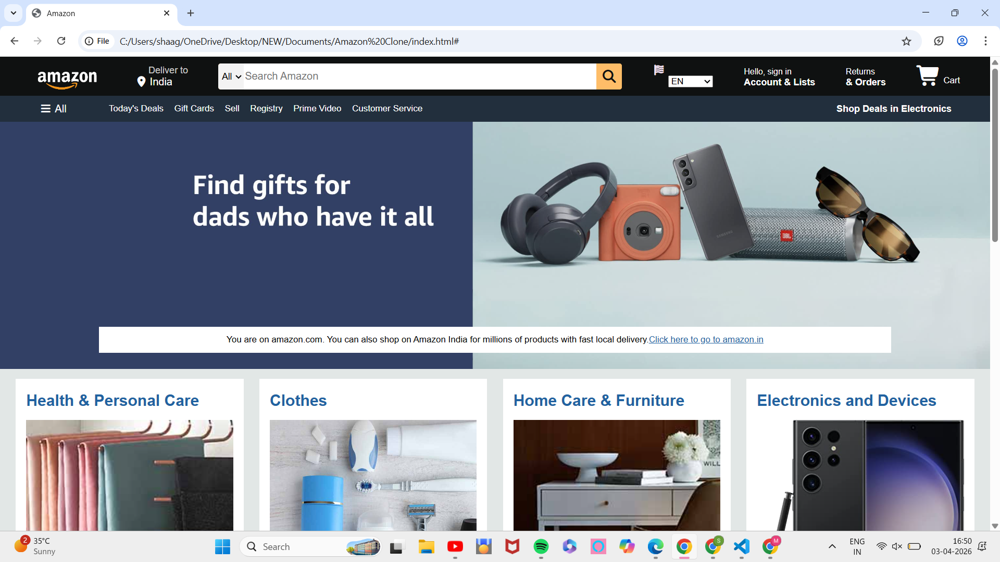
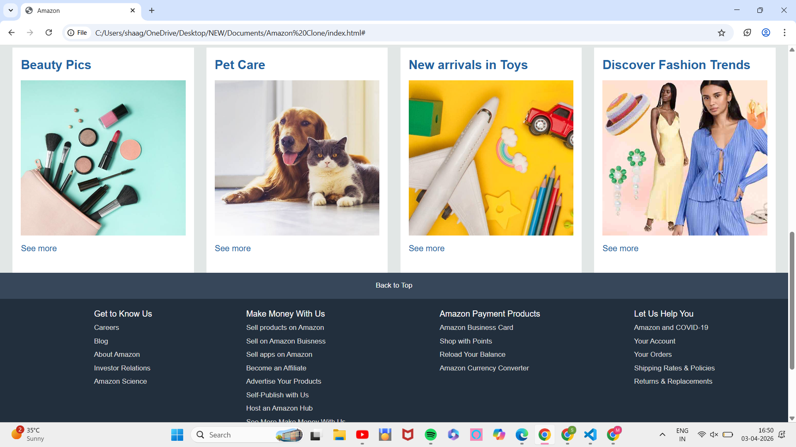
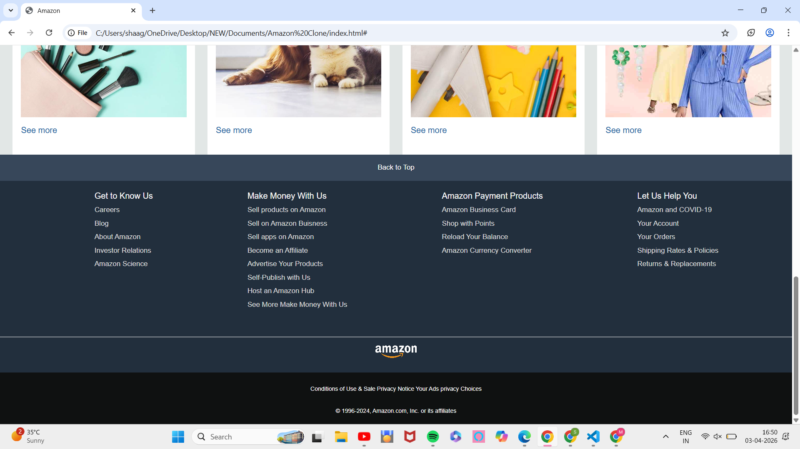

# 🛒 Amazon Clone 
### Responsive E-commerce Website - HTML5 & CSS3

## ✨ **Features**
- 📱 **Fully Responsive** - Mobile, Tablet, Desktop
- 🛍️ **Amazon-style** Navigation & Product Grid
- ✨ **Smooth Hover Animations** & Transitions
- 🎨 **CSS Grid + Flexbox** Layouts
- 🎯 **Pixel-perfect** Amazon UI Design
- 🔍 **Search Bar** & Cart Functionality (UI)
- 📊 **Modern CSS** - Variables, Shadows, Gradients

## 📱 **Live Demo**
 From Netlify : https://playful-palmier-0e88fc.netlify.app/
/** My-Drop-Site **/

From GitHub: https://shagunmishra26.github.io/Amazon-Clone/

## 🖼️ **Screenshots**

